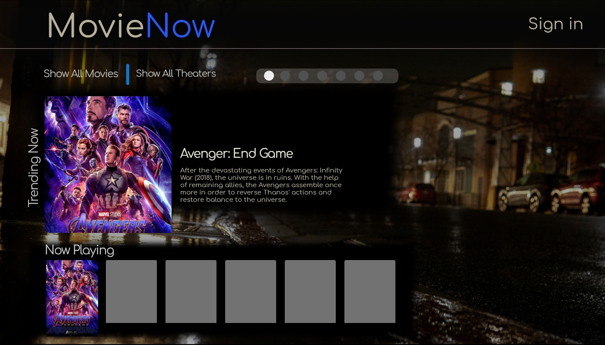

# Movie Now

Movie Poster source: Avenger
Background photo credit: Jack Phan

# User Story
The user will go to the homepage and be shown a listing of select movies and links to all movies and theaters that are available. The user will be able to browse theatre and movie pages without logging in. The theatre pages will show all the movies and movie times in that theatre. 
The movie pages will show all of the theatres it is shown in as well as a description of that movie, including director, actors, plot summary and genre. The user can sign-up and create a profile. They will also have the option to edit or delete their profile. When the user is logged-in, they will be able to click links on the theatre page or movie page and will be taken to another page to purchase tickets. They will be given an option for the number of tickets desired and they will enter their payment information. There will be an admin section. A user logged in as an admin will have access to create, edit and delete movies and theatres. The admin section of the site will be inaccessible to regular users.
# MVP
The MVP version of the site will contain a model for theatres and movies. These models will have full CRUD functionality and will be linked in a many-to-many relationship. There will also be a showing model. The showings model will relate to both the theatres and movies models in a one-to-many relationship. There will be functionality to add and edit the showings. The edit functionality will allow for showings to be hidden from the site visitors, if they need to be removed from the site. A site visitor will be able to view movies and theatres in the database and select the movie that they wish to see. The admin route will be unprotected. The admin will have a limited menu of showtime options. There will not be a user model.
# Milestones
- Monday: Server running, Theatre, Showings and Movie models built, Admin routes able to add and edit.  
- Tuesday: All front end pages framed out with minimal CSS, all pages may not be able to reference database, Movie and Theatre show page and ticket confirmation page fully functional.  
- Wednesday: MVP without CSS.  
- Thursday: CSS and stretch goals.  
# Stretch Goals
- Adding a user model  
- Protecting the Admin routes  
- Full freedom for adding and editing Showings  
- Search functionality  
- Bootstrap carousel for movie images  
- API for theatres and movie listings  
- API for YouTube movie trailers 
